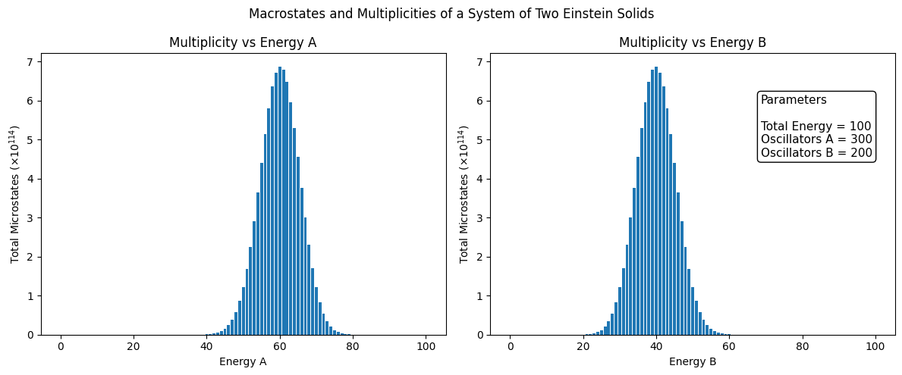

# Einstein Solid Multiplicity Visualizer

While self-studying thermal physics from *An Introduction to Thermal Physics* by Daniel V. Schroeder, I became interested in the relationship between energy exchange between two Einstein solids and their multiplicities, discussed in Section 2.3 ("Interacting Systems").

To better understand the concept, I developed this Python program that calculates and visualizes the multiplicity of two interacting Einstein solids for arbitrary numbers of oscillators and energy quanta.

## Features

- Calculates multiplicities using the Einstein solid model
- User-defined numbers of oscillators and energy quanta
- Visualizes total multiplicity as energy is exchanged

## Limitations and Possible Improvements
1) This model can adequately handle small numbers. However, in a large system where we talk about numbers in the order of magnitude of 23 (e.g Avogadro's Constant), the model might be inaccurate. As a possible improvement, the treatment of Stirling's Approximation for large numbers cane be implemented so that the plots will be more reliable.
2) Entropy is a key concept that is direclty related with multiplicities. Later on, I am planning to add entropy to the calculator. 
## Example

